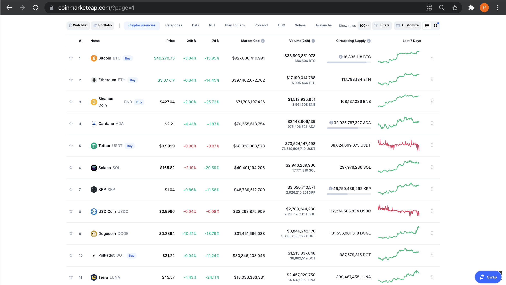

# Scrape cryptocurrency prices

website: https://coinmarketcap.com/

I need scrape [coinmarketcap](https://coinmarketcap.com/) and store url, name and price of each cryptocurrency into an json file.

